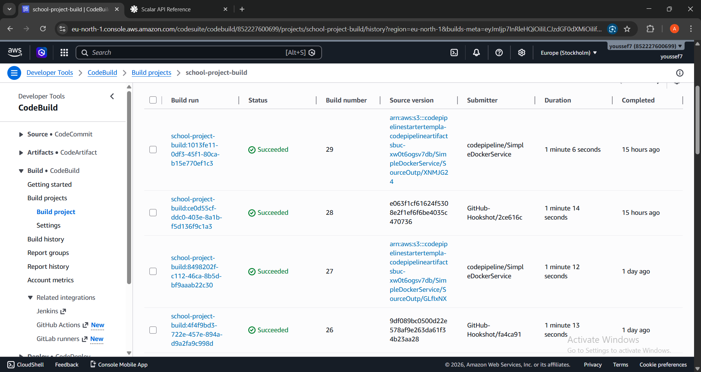
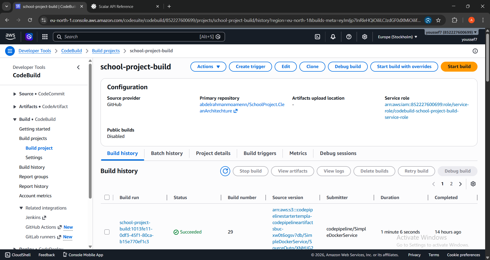
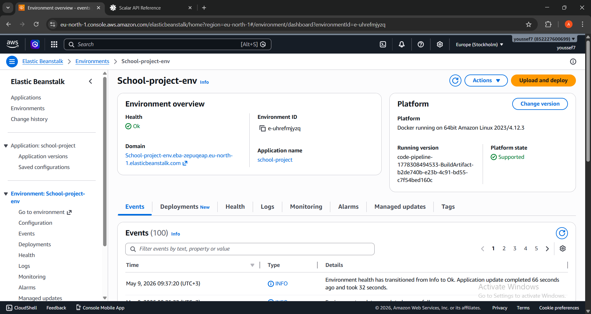
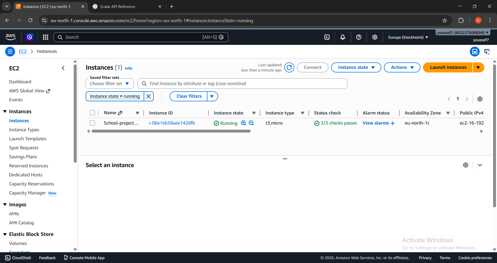
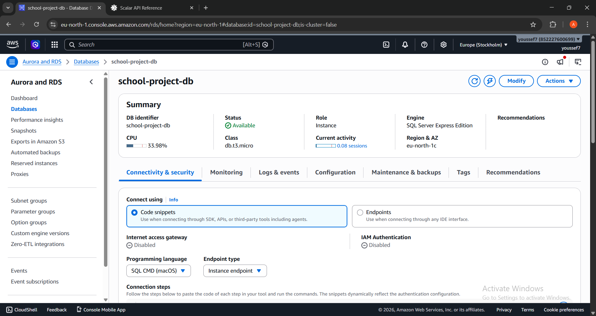
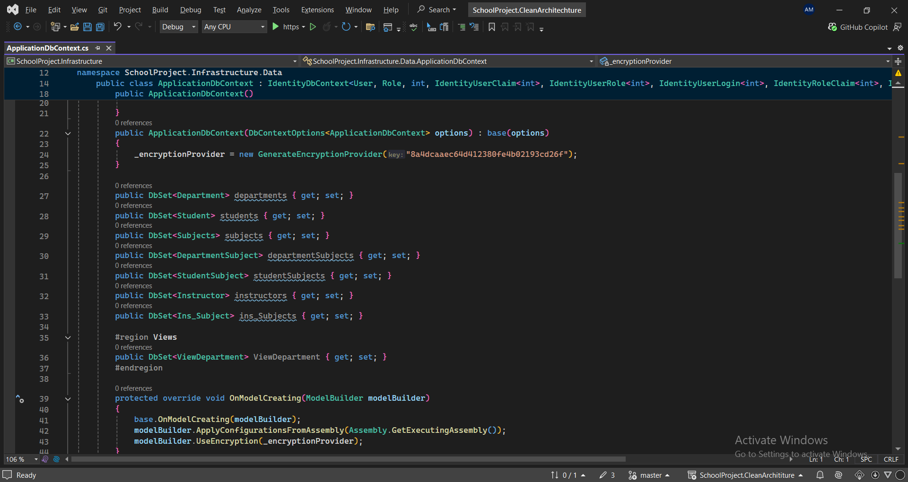
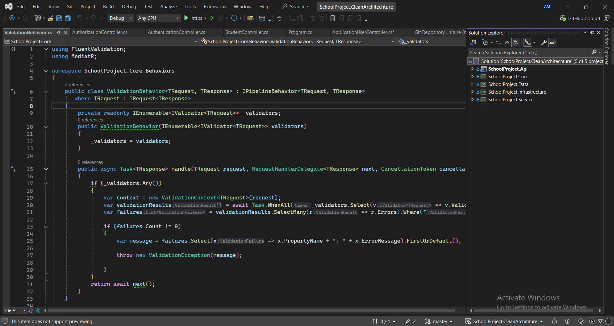
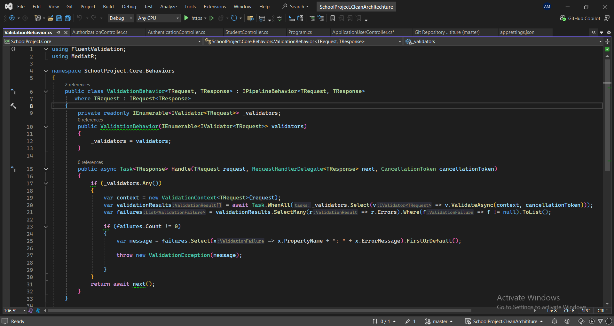

# 🏫 School Management System — Clean Architecture REST API

<p align="center">
  
  
  
  
  
  
  
  
  
</p>

A **production-deployed** school management REST API built with **ASP.NET Core 9** following strict **Clean Architecture** principles. The system delivers CQRS via MediatR, role and claims-based authorization, JWT authentication with refresh token rotation, bilingual localization (Arabic/English/German/French), column-level AES encryption, structured logging, Docker containerization, and a fully automated AWS CI/CD pipeline that deploys on every commit.

**🌐 Live API Explorer →** [school-project-env.eba-zepuqeap.eu-north-1.elasticbeanstalk.com/scalar](http://school-project-env.eba-zepuqeap.eu-north-1.elasticbeanstalk.com/scalar)

**🎬 CI/CD Pipeline Demo →** [Watch pipeline auto-deploy on commit](https://streamable.com/4i9rut)

**🎬 Full API Walkthrough →** [Authentication · Localization · Pagination demo](https://streamable.com/eldghj)

---

## 📋 Table of Contents

- [Overview](#-overview)
- [Live Deployment](#-live-deployment)
- [Features](#-features)
- [Tech Stack](#-tech-stack)
- [Architecture & Design Patterns](#-architecture--design-patterns)
- [Project Structure](#-project-structure)
- [Screenshots](#-screenshots)
- [Getting Started](#-getting-started)
- [API Reference](#-api-reference)
- [Security Model](#-security-model)
- [Database Design](#-database-design)
- [Testing](#-testing)
- [Docker Deployment](#-docker-deployment)
- [AWS Infrastructure & CI/CD](#-aws-infrastructure--cicd)
- [Technical Highlights](#-technical-highlights)
- [Challenges Solved](#-challenges-solved)
- [Future Improvements](#-future-improvements)
- [Why This Project Stands Out](#-why-this-project-stands-out)
- [Author](#-author)

---

## 🔍 Overview

This project is a fully-featured, **production-deployed** backend API for managing a school's core entities — students, departments, instructors, subjects, users, and roles — engineered to demonstrate enterprise-level backend development practices.

The architecture enforces strict separation of concerns across five dedicated C# projects. Every design decision reflects real-world production patterns: structured error handling, transactional multi-step operations, database migrations with seeding, email confirmation workflows, image uploads, multi-language support, AES column encryption, and a live AWS deployment that auto-deploys on every `git push`.

---

## 🌐 Live Deployment

| Resource | URL |
|---|---|
| **API Explorer (Scalar)** | [school-project-env.eba-zepuqeap.eu-north-1.elasticbeanstalk.com/scalar](http://school-project-env.eba-zepuqeap.eu-north-1.elasticbeanstalk.com/scalar) |
| **Environment** | AWS Elastic Beanstalk (eu-north-1) |
| **Compute** | Amazon EC2 |
| **Database** | Amazon RDS (SQL Server Express) |
| **CI/CD** | AWS CodeBuild — auto-deploys on every push to `main` |

> The API runs `db.Database.Migrate()` on startup — the database schema and all seed data are created automatically on any fresh instance, including production RDS.

**Default Admin Credentials (seeded)**

| Field | Value |
|---|---|
| Username | `budi` |
| Password | `Budi_123` |
| Email | `admin@project.com` |
| Role | `Admin` |

---

## ✨ Features

### 🎓 Student Management
- Full CRUD with server-side **pagination**, **search** (bilingual — Arabic & English), and **sorting** by ID, name, address, or department
- Department-level filtering via composable `IQueryable` projections
- Duplicate-name validation per language field with self-exclusion on edit

### 🏛 Department Management
- Detailed department response including subjects, instructor list, and a paginated student list in a single endpoint
- **Database View** integration (`ViewDepartment`) for aggregated student-count reporting — avoids in-memory grouping

### 👨‍🏫 Instructor Management
- Add instructors with **image upload** (`multipart/form-data`) stored in `wwwroot` and served as static files
- Self-referencing supervisor hierarchy with correct `OnDelete(Restrict)` cascade protection
- Bilingual name validation (Arabic + English) with self-exclusion on edit

### 🔐 Authentication
- **JWT Bearer** token issuance with configurable expiry
- **Refresh token rotation** — tokens stored with `IsUsed`, `IsRevoked`, `JwtId`, and `ExpiryDate` to prevent replay attacks
- **Email confirmation** enforced before first login (tokenized link via MailKit SMTP)
- **Password reset** flow: 6-digit code generated, AES-encrypted at rest, delivered by email, verified, then cleared on reset

### 🛡 Authorization
- **Role-based authorization** (`Admin` / `User` roles)
- **Claims-based policies** (`CreateStudent`, `EditStudent`, `DeleteStudent`)
- **`AuthFilter`** — a custom `IAsyncActionFilter` for runtime role verification independent of controller-level attributes, demonstrating layered guard strategies

### 👤 User & Role Management
- Register, edit, delete, and paginate users
- Change password with current-password verification and same-password rejection
- Create, edit, and delete roles with in-use protection
- Assign/revoke roles per user (bulk update in a single transaction)
- Assign/revoke claims per user (bulk update in a single transaction)

### 🌍 Localization
- Full **multilingual support**: Arabic (`ar-EG`), English (`en-US`), German (`de-DE`), French (`fr-FR`)
- All validation messages and API responses are resolved via `.resx` resource files
- Culture detected from the `Accept-Language` request header
- Bilingual entity fields (`NameAr` / `NameEn`) resolved at the entity level via `Localize()` helper on `GeneralLocalizableEntity`

### 📧 Email Service
- SMTP email delivery via **MailKit**
- Registration confirmation link generation using `IUrlHelper`
- Password reset code delivery

### 📊 Logging & Observability
- **Serilog** structured logging to both **Console** and a **SQL Server** `SystemLogs` table (auto-created)
- Per-namespace log-level filtering (Microsoft namespace silenced below Error in production)

### 🧑‍💻 Developer Experience
- **Scalar UI** (modern OpenAPI explorer) at `/scalar/v1` with JWT Bearer scheme pre-configured
- **Auto-migration and seeding** on startup — zero manual database setup on any environment

---

## 🛠 Tech Stack

| Category | Technology |
|---|---|
| Runtime | .NET 9 |
| Web Framework | ASP.NET Core 9 Web API |
| ORM | Entity Framework Core 9 |
| Database | Microsoft SQL Server 2022 |
| Cloud Database | Amazon RDS (SQL Server) |
| Hosting | AWS Elastic Beanstalk + EC2 |
| CI/CD | AWS CodeBuild |
| CQRS / Mediator | MediatR 14 |
| Validation | FluentValidation 12 |
| Mapping | AutoMapper 12 |
| Authentication | ASP.NET Core Identity + JWT Bearer |
| Encryption | EntityFrameworkCore.EncryptColumn (AES-256) |
| Email | MailKit 4 |
| Logging | Serilog (Console + MSSQL sink) |
| API Documentation | Scalar / OpenAPI 9 |
| Containerization | Docker + Docker Compose |
| Testing | xUnit v3, Moq, FluentAssertions, EntityFrameworkCore.Testing.Moq |
| Architecture | Clean Architecture |
| Patterns | CQRS, Repository, Generic Repository, Mediator, Pipeline Behavior, Action Filter |

---

## 🏗 Architecture & Design Patterns

This project applies **Clean Architecture** with a strict inward dependency rule — outer layers depend on inner layers, never the reverse.

```
┌─────────────────────────────────────────────────────────────────┐
│                        SchoolProject.Api                        │
│             Controllers · Middleware · Filters · DI             │
├─────────────────────────────────────────────────────────────────┤
│                       SchoolProject.Core                        │
│     CQRS Handlers · Validators · Mappings · Response Handler    │
├───────────────────────────┬─────────────────────────────────────┤
│    SchoolProject.Service  │  SchoolProject.Infrastructure       │
│    Business Logic ·       │  Repositories · DbContext ·         │
│    Email · File · Auth    │  Migrations · EF Configurations     │
├───────────────────────────┴─────────────────────────────────────┤
│                       SchoolProject.Data                        │
│             Entities · DTOs · Enums · Helpers · Results         │
└─────────────────────────────────────────────────────────────────┘
```

### Key Engineering Decisions

**CQRS with MediatR** — Every API operation is a `Command` (write) or `Query` (read), handled by a dedicated `IRequestHandler`. This eliminates fat controllers and makes each use case independently testable and maintainable.

**FluentValidation Pipeline Behavior** — A MediatR `IPipelineBehavior<TRequest, TResponse>` intercepts every command and query *before* it reaches the handler. Validation failures are caught by the global error middleware and returned as `422 Unprocessable Entity` — zero validation code in controllers or handlers.

**Generic Repository** — `IGenericRepositoryAsync<T>` provides consistent CRUD, range operations, and transaction support (`BeginTransaction` / `Commit` / `RollBack`) across all entities. Specialized repositories extend it only where domain-specific queries are required.

**Uniform Response Envelope** — All endpoints return a `Response<T>` object containing `StatusCode`, `Succeeded`, `Message`, `Data`, `Errors`, and `Meta`. This makes client-side error handling predictable and testable.

**AutoMapper Partial Classes** — Mapping profiles are split into partial classes per operation type (e.g., `AddStudentMapping`, `EditStudentMapping`, `GetStudentByIdMapping`), keeping each file focused and under 30 lines.

**Keyless Entity for DB View** — `ViewDepartment` is mapped to a SQL Server view using EF Core's `[Keyless]` attribute, allowing complex aggregations to stay in the database layer without loading raw data into application memory.

---

## 📁 Project Structure

```
SchoolProject.CleanArchitechture/
├── SchoolProject.Api/               # Entry point — controllers, middleware, Program.cs
│   ├── Controllers/                 # StudentController, AuthenticationController, etc.
│   ├── Base/                        # AppControllerBase (shared MediatR + response helpers)
│   └── appsettings.json             # JWT, SMTP, Serilog, connection string config
│
├── SchoolProject.Core/              # Application layer
│   ├── Features/                    # Organized by domain → Commands + Queries + Validators
│   │   ├── Students/
│   │   ├── Departments/
│   │   ├── Instructors/
│   │   ├── Users/
│   │   ├── Authentication/
│   │   └── Authorization/
│   ├── Mapping/                     # AutoMapper profiles (partial classes per operation)
│   ├── Behaviors/                   # ValidationBehavior MediatR pipeline
│   ├── Bases/                       # Response<T>, ResponseHandler
│   ├── Filters/                     # AuthFilter (action-level role check)
│   ├── Middleware/                  # ErrorHandlerMiddleware (global exception handler)
│   ├── Resources/                   # .resx files (en-US, ar-EG, de-DE, fr-FR)
│   └── Wrappers/                    # PaginatedResult<T>, QueryableExtensions
│
├── SchoolProject.Data/              # Domain layer — pure C# with no framework dependencies
│   ├── Entities/                    # Student, Department, Instructor, Subjects, etc.
│   │   ├── Identity/                # User, Role, UserRefreshToken
│   │   └── Views/                   # ViewDepartment (keyless entity)
│   ├── Commons/                     # GeneralLocalizableEntity (Localize helper)
│   ├── Enums/                       # StudentOrderingEnum
│   ├── Helpers/                     # JwtSettings, EmailSettings, ClaimsStore
│   ├── Requests/                    # Update role/claims request models
│   ├── Results/                     # JwtAuthResult, ManageUserRolesResult
│   └── AppMetaData/                 # Router (all route constants in one place)
│
├── SchoolProject.Infrastructure/    # Data access layer
│   ├── Context/                     # ApplicationDbContext (IdentityDbContext<User, Role, int>)
│   ├── Configurations/              # IEntityTypeConfiguration per entity + seeding
│   ├── InfrastructureBases/         # GenericRepositoryAsync<T>
│   ├── IRepositories/               # Repository interfaces
│   ├── Repositories/                # Repository implementations + Views
│   ├── Migrations/                  # EF Core migrations
│   ├── Seeder/                      # RoleSeeder, UserSeeder (run at startup)
│   └── ServiceRegisteration.cs      # Identity, JWT, Authorization policies DI
│
├── SchoolProject.Service/           # Business logic layer
│   ├── Abstracts/                   # Service interfaces
│   ├── Implementations/             # StudentService, DepartmentService, AuthService, etc.
│   └── AuthServices/                # ICurrentUserService + implementation
│
├── SchoolProject.XUnitTest/         # Unit test project
│   ├── CoreTests/Students/          # Command and query handler tests
│   └── ServicesTest/                # Extension method tests
│
├── docs/
│   └── screenshots/                 # AWS console + code structure screenshots
├── Dockerfile                       # Multi-stage Docker build
└── docker-compose.local.yml         # SQL Server + API services for local dev
```

---

## 📸 Screenshots

### ☁️ AWS Infrastructure

<table>
  <tr>
    <td align="center"><strong>CodeBuild — CI/CD History</strong></td>
    <td align="center"><strong>CodeBuild — Successful Build</strong></td>
  </tr>
  <tr>
    <td></td>
    <td></td>
  </tr>
  <tr>
    <td align="center"><strong>Elastic Beanstalk — Health OK</strong></td>
    <td align="center"><strong>EC2 Instance — Running</strong></td>
  </tr>
  <tr>
    <td></td>
    <td></td>
  </tr>
  <tr>
    <td align="center"><strong>RDS — Database Available</strong></td>
    <td></td>
  </tr>
  <tr>
    <td></td>
    <td></td>
  </tr>
</table>

### 🧠 Code Highlights

<table>
  <tr>
    <td align="center"><strong>AES Column Encryption</strong></td>
    <td align="center"><strong>Solution Structure (5 Projects)</strong></td>
    <td align="center"><strong>Validation Pipeline Behavior</strong></td>
  </tr>
  <tr>
    <td></td>
    <td></td>
    <td></td>
  </tr>
</table>

---

## 🚀 Getting Started

### Prerequisites

| Tool | Version |
|---|---|
| .NET SDK | 9.0+ |
| SQL Server | 2019+ (or Docker) |
| Docker & Docker Compose | Latest (for containerized setup) |

---

### Option 1 — Docker (Recommended, Zero Configuration)

```bash
# Clone the repository
git clone https://github.com/abdelrahmanmoamenn/SchoolProject.CleanArchitechture.git
cd SchoolProject.CleanArchitechture

# Copy the local compose file and set required secrets
cp docker-compose.local.yml docker-compose.yml

# Set environment variables (or create a .env file)
export SA_PASSWORD="YourStrong!Passw0rd"
export JWT_SECRET="your-minimum-32-character-secret-key"
export EMAIL_PASSWORD="your-smtp-app-password"

# Start SQL Server + API
docker compose up --build
```

The API will be available at **http://localhost:8888**
Scalar API explorer: **http://localhost:8888/scalar/v1**

> The API runs `db.Database.Migrate()` on startup — the database and all seed data are created automatically.

---

### Option 2 — Local Development

**1. Clone the repository**
```bash
git clone https://github.com/abdelrahmanmoamenn/SchoolProject.CleanArchitechture.git
cd SchoolProject.CleanArchitechture
```

**2. Configure `appsettings.json`**

```json
"ConnectionStrings": {
  "SchoolDb": "Server=YOUR_SERVER;Database=SchoolDb;Trusted_Connection=True;MultipleActiveResultSets=true"
},
"jwtSettings": {
  "secret": "your-minimum-32-character-secret-key",
  "issuer": "SchoolProject",
  "audience": "WebSite",
  "AccessTokenExpireDate": 1,
  "RefreshTokenExpireDate": 20
},
"emailSettings": {
  "host": "smtp.gmail.com",
  "port": 465,
  "FromEmail": "your-email@gmail.com",
  "password": "your-app-password"
}
```

**3. Run the API**
```bash
cd SchoolProject.Api
dotnet run
```

The API auto-applies all migrations and seeds the database on first launch. Navigate to `http://localhost:5247/scalar/v1` to explore all endpoints.

---

## 📡 API Reference

All routes follow the pattern `/Api/V1/<Resource>/`

### 🔑 Authentication

| Method | Endpoint | Description | Auth |
|---|---|---|---|
| `POST` | `/Api/V1/Authentication/SignIn/` | Obtain access + refresh token | Public |
| `POST` | `/Api/V1/Authentication/Refresh-Token/` | Rotate refresh token | Public |
| `GET` | `/Api/V1/Authentication/Validate-Token/` | Validate access token | Public |
| `GET` | `/Api/Authentication/ConfirmEmail` | Confirm email from link | Public |
| `POST` | `/Api/V1/Authentication/Send-Reset-Password-Code/` | Send 6-digit reset code to email | Public |
| `GET` | `/Api/V1/Authentication/Confirm-Reset-Password-Code/` | Verify reset code | Public |
| `POST` | `/Api/V1/Authentication/Reset-Password/` | Set new password | Public |

### 🎓 Students

| Method | Endpoint | Description | Auth |
|---|---|---|---|
| `GET` | `/Api/V1/Student/List/` | Get all students | `User` role + `AuthFilter` |
| `GET` | `/Api/V1/Student/Paginated/` | Paginated + filtered + sorted students | `Admin` role |
| `GET` | `/Api/V1/Student/{id}` | Get student by ID | `Admin` role |
| `POST` | `/Api/V1/Student/Create/` | Create student | `CreateStudent` claim |
| `PUT` | `/Api/V1/Student/Edit/` | Update student | `EditStudent` claim |
| `DELETE` | `/Api/V1/Student/Delete/{id}` | Delete student | `DeleteStudent` claim |

### 🏛 Departments

| Method | Endpoint | Description | Auth |
|---|---|---|---|
| `GET` | `/Api/V1/Department/Id/` | Get department with subjects, instructors, students | JWT |
| `GET` | `/Api/V1/Department/Department-Students-Count/` | Student count per department (via DB View) | JWT |

### 👨‍🏫 Instructors

| Method | Endpoint | Description | Auth |
|---|---|---|---|
| `POST` | `/Api/V1/Instructor/Create/` | Add instructor with image (`multipart/form-data`) | Public |

### 👤 Users

| Method | Endpoint | Description | Auth |
|---|---|---|---|
| `POST` | `/Api/V1/ApplicationUser/Create/` | Register new user + send confirmation email | `Admin` role |
| `GET` | `/Api/V1/ApplicationUser/Paginated/` | Paginated user list | Public |
| `GET` | `/Api/V1/ApplicationUser/{id}` | Get user by ID | `Admin` role |
| `PUT` | `/Api/V1/ApplicationUser/Edit/` | Update user profile | `Admin` role |
| `PUT` | `/Api/V1/ApplicationUser/Change-Password/` | Change password | `Admin` role |
| `DELETE` | `/Api/V1/ApplicationUser/Delete/{id}` | Delete user | `Admin` role |

### 🛡 Roles & Claims

| Method | Endpoint | Description | Auth |
|---|---|---|---|
| `POST` | `/Api/V1/Authorization/Roles/Create/` | Create role | `Admin` role |
| `POST` | `/Api/V1/Authorization/Roles/Edit/` | Edit role | `Admin` role |
| `DELETE` | `/Api/V1/Authorization/Roles/Delete/{id}` | Delete role (blocked if in use) | `Admin` role |
| `GET` | `/Api/V1/Authorization/Roles/List/` | List all roles | `Admin` role |
| `GET` | `/Api/V1/Authorization/Roles/Manage-User-Roles/{id}` | Get user role assignments | `Admin` role |
| `POST` | `/Api/V1/Authorization/Roles/Update-User-Roles/` | Bulk update user roles | `Admin` role |
| `GET` | `/Api/V1/Authorization/Claims/Manage-User-Claims/{id}` | Get user claim assignments | `Admin` role |
| `POST` | `/Api/V1/Authorization/Claims/Update-User-Claims/` | Bulk update user claims | `Admin` role |

### 📧 Email

| Method | Endpoint | Description | Auth |
|---|---|---|---|
| `POST` | `/Api/V1/Emails/SendEmail/` | Send a direct email | Public |

---

## 🔐 Security Model

### Authentication Flow

```
Client → POST /SignIn (credentials)
       ← 200 { AccessToken, RefreshToken }

Client → Any protected endpoint (Bearer <AccessToken>)
       ← 200 / 401

Client → POST /Refresh-Token (AccessToken + RefreshToken)
       ← 200 { New AccessToken, Same RefreshToken }
```

### Three-Layer Authorization

| Layer | Mechanism | Example Endpoint |
|---|---|---|
| Role-based | `[Authorize(Roles = "Admin")]` on controller | All user management |
| Claims-based | `[Authorize(Policy = "CreateStudent")]` | Student create/edit/delete |
| Action filter | `[ServiceFilter(typeof(AuthFilter))]` — runtime role check | Student list |

### JWT Claims Payload

Each token includes: `Name`, `NameIdentifier`, `Email`, `PhoneNumber`, `Id`, all user roles, and all user claims — enabling fine-grained authorization at every layer without additional database hits.

### Column-Level AES Encryption

The `User.Code` field (password reset code) is encrypted at rest using `EntityFrameworkCore.EncryptColumn` with a hardcoded AES key configured in `ApplicationDbContext`. The ORM transparently handles encryption and decryption.

```csharp
// User.cs
[EncryptColumn]
public string? Code { get; set; }

// ApplicationDbContext.cs
_encryptionProvider = new GenerateEncryptionProvider("8a4dcaaec64d412380fe4b02193cd26f");
modelBuilder.UseEncryption(_encryptionProvider);
```

---

## 🗄 Database Design

### Entity Relationships

```
Department ──< DepartmentSubject >── Subjects
     │                                   │
     │                               Ins_Subject
     │                                   │
     ├──< Students >── StudentSubject    │
     │                                   │
     └──< Instructors >─────────────────┘
           │
           └── SupervisorId → self (self-referencing, OnDelete: Restrict)
           │
           └── InsManager ↔ Department (1:1, OnDelete: Restrict)

User ──< UserRefreshToken
  (IsUsed · IsRevoked · JwtId · ExpiryDate fields for replay protection)
```

### Database View Integration

`ViewDepartment` is a keyless EF entity mapped to a SQL Server view that aggregates student counts per department — used by the `GetDepartmentStudentsCount` endpoint. This avoids expensive in-memory group-by operations on large datasets.

### Seeded Data (Auto-applied on startup)

| Entity | Count |
|---|---|
| Departments | 3 (CS, Engineering, Science) |
| Subjects | 5 |
| Instructors | 4 (with supervisor hierarchy) |
| Students | 5 |
| Student-Subject Enrollments | 10 (with grades) |
| Roles | 2 (Admin, User) |
| Admin User | 1 |

---
## 🧪 Testing

The project includes a dedicated xUnit test project (`SchoolProject.XUnitTest`) covering CQRS handlers and utility extensions.

| Test Class | Coverage |
|---|---|
| `StudentCommandHandlerTest` | Add student → 201 Created; Add failure → 400 Bad Request; Edit missing student → 400 Bad Request |
| `StudentQueryHandlerTest` | List students; Get by ID (found → 200, not found → 404); Paginated list with filtering |
| `ExtensionMethodTest` | `ToPaginatedListAsync` returns correct paginated result |

**Libraries used:** `xUnit v3`, `Moq`, `FluentAssertions`, `EntityFrameworkCore.Testing.Moq`

**Test patterns demonstrated:** Arrange-Act-Assert, `[Theory]` + `[InlineData]`, `[MemberData]`, `[ClassData]`, `Mock.Setup`, `Mock.Verify`, `CollectionBehavior` parallelism control.

---

## 🐳 Docker Deployment

Multi-stage `Dockerfile` and `docker-compose.local.yml` orchestrate both services with a SQL Server health gate.

```yaml
services:
  sqlserver:
    healthcheck:
      test: ["CMD-SHELL", "/opt/mssql-tools18/bin/sqlcmd -S localhost -U sa -P '${SA_PASSWORD}' -Q 'SELECT 1' -No"]
      interval: 10s
      retries: 10

  api:
    depends_on:
      sqlserver:
        condition: service_healthy   # API never starts before DB is ready
    environment:
      ConnectionStrings__SchoolDb: "Server=sqlserver,1433;..."
      jwtSettings__secret: ${JWT_SECRET}
      emailSettings__password: ${EMAIL_PASSWORD}
```

**Multi-stage Dockerfile:**
- **Build stage** — `mcr.microsoft.com/dotnet/sdk:9.0`: restores, builds, publishes
- **Runtime stage** — `mcr.microsoft.com/dotnet/aspnet:9.0`: minimal image, copies published output and `.resx` localization resource files

```bash
docker compose up --build   # Single command — fully running API at localhost:8888
```

---

## ☁️ AWS Infrastructure & CI/CD

```
Developer Push → GitHub (main branch)
                       ↓
                 AWS CodeBuild
     (dotnet restore → build → publish → package → deploy)
                       ↓
           AWS Elastic Beanstalk (eu-north-1)
                       ↓
              EC2 Instance (ASP.NET Core runtime)
                       ↓
              Amazon RDS (SQL Server — auto-migrated on startup)
```

| AWS Service | Role |
|---|---|
| **Elastic Beanstalk** | Managed application hosting, health monitoring, rolling deployments |
| **EC2** | Underlying compute running the .NET 9 runtime |
| **Amazon RDS** | Managed SQL Server with automated backups |
| **CodeBuild** | CI/CD pipeline — triggered on every `git push` to `main` |

Every commit triggers CodeBuild, which compiles, packages, and deploys the updated application to Elastic Beanstalk automatically — no manual SSH, no manual deployments.

---

## 💡 Technical Highlights

**1. MediatR Pipeline Validation** — `ValidationBehavior<TRequest, TResponse>` runs all FluentValidation validators before any handler executes. Controllers stay at 5–10 lines. No validation logic leaks into the application layer.

**2. Bilingual Search in EF Core** — `Localize(ar, en)` resolves the correct field based on `Thread.CurrentThread.CurrentCulture`. Used in `IQueryable` projections (client-evaluated after the database `SELECT`) to avoid SQL translation failures while supporting both Arabic and English search simultaneously.

**3. Projection-based Pagination** — `ToPaginatedListAsync` executes `COUNT(*)` and the paginated `SELECT` as two separate optimized queries, projecting to DTOs directly via `Expression<Func<TEntity, TDTO>>`. No full entity graphs loaded into memory.

**4. Database View for Aggregation** — Department student counts are fetched from a SQL Server view registered as a keyless EF entity, keeping aggregation logic in the database engine rather than application memory.

**5. Refresh Token Rotation with Replay Protection** — Every refresh token is stored with `IsUsed`, `IsRevoked`, `ExpiryDate`, and the linked JWT ID. Expired tokens are explicitly marked revoked; reuse after rotation is detected and blocked before a new token is issued.

**6. AES Column Encryption** — `[EncryptColumn]` on `User.Code` persists the password reset code encrypted to the database. The ORM transparently handles encryption/decryption — zero manual crypto code in the application layer.

**7. Self-Referencing Supervisor Hierarchy** — `Instructor.SupervisorId` FK points to itself, configured with `OnDelete(Restrict)` to prevent cascading deletion of supervisor records when a subordinate is removed.

**8. Transactional Multi-Step Operations** — User registration (create → assign role → send email), password reset (generate code → update user → send email), and role updates are all wrapped in explicit `BeginTransactionAsync` / `CommitAsync` / `RollbackAsync` blocks for data consistency.

**9. Docker Startup Race Condition Fix** — The Compose `healthcheck` uses `sqlcmd SELECT 1` to verify SQL Server readiness before the API container starts, eliminating the startup race condition that commonly breaks .NET + SQL Server setups in CI/CD.

**10. AWS Auto-Migration** — `db.Database.Migrate()` runs inside a scoped service at startup, ensuring the database schema and seed data are always synchronized with the deployed application version — including on fresh RDS instances.

---

## 🧗 Challenges Solved

**Circular FK Between Department and Instructor** — `Department.InsManager → Instructor` and `Instructor.DID → Department` creates a mutual FK dependency. Resolved using `OnDelete(Restrict)` on both ends and careful migration ordering in EF Core.

**Bilingual LINQ Search** — Making `Localize()` work inside `IQueryable` expressions without triggering EF Core SQL translation errors required careful separation: server-evaluated `Where` clauses (on raw fields) and client-evaluated `Select` projections (for the localized display value).

**Seeding Self-Referencing Data** — Seeding instructors with supervisor relationships required inserting base records (supervisors without `SupervisorId`) first, then supervised records in a second pass — EF Core's `HasData` does not guarantee insertion order automatically.

**Docker SQL Server Race Condition** — Coordinating the API container to wait until SQL Server is fully initialized (not just container-started) required a `CMD-SHELL` healthcheck using the `sqlcmd` CLI with `-No` (trust certificate) flag, which was specific to SQL Server 2022 on Linux.

**Localization in Multi-Environment Deployment** — `.resx` resource files are compiled into the assembly on Windows but the Dockerfile required an explicit `COPY` step for the Resources folder into the runtime image to ensure they were available at startup on the Linux container.

---

## 🔭 Future Improvements

- [ ] xUnit integration tests with Testcontainers (isolated SQL Server per test run)
- [ ] Redis distributed caching for department and subject read endpoints
- [ ] Refresh token revocation on password change (invalidate all active tokens for a user)
- [ ] Rate limiting middleware on authentication endpoints (brute-force protection)
- [ ] Soft-delete pattern for students and users (IsDeleted flag instead of hard delete)
- [ ] OpenTelemetry distributed tracing
- [ ] Migrate image storage from `wwwroot` to AWS S3 or Azure Blob Storage
- [ ] `IOptions<T>` pattern for strongly-typed configuration bindings
- [ ] GitHub Actions workflow mirroring the AWS CodeBuild pipeline for open-source contributors

---

## 🌟 Why This Project Stands Out

**It is live on AWS.** A real production deployment with EC2, RDS, Elastic Beanstalk, and a CI/CD pipeline that deploys on every `git push` — not a localhost demo.

**Real Clean Architecture.** Not just folders named after layers, but enforced dependency direction across five dedicated C# projects with proper DI wiring and zero cross-layer leakage. `SchoolProject.Data` has no framework dependencies. `SchoolProject.Infrastructure` depends on `Data` only. The direction is always inward.

**Production-grade authentication.** Refresh token rotation with replay protection, AES-encrypted reset codes, email confirmation workflows, and claims-based authorization policies — all in one cohesive, working system.

**Zero-configuration startup.** Auto-migration, seeding, Docker healthchecks, and AWS auto-deploy mean the project goes from `git clone` to a fully running API in under five minutes — on any machine, in any environment.

**Bilingual by design.** Localization is built into the entity base class, the response handler, and all four `.resx` resource files — not added as an afterthought. Arabic, English, German, and French all work via `Accept-Language` header.

**Observability included.** Serilog writes structured logs to both the console and a SQL Server `SystemLogs` table (auto-created), matching how production systems are actually monitored.

**Consistent API contract.** Every endpoint returns the same `Response<T>` envelope, making frontend integration and testing predictable and reliable across all endpoints.

---

## 📁 Repository Structure (Top-Level)

```
SchoolProject.CleanArchitechture/
├── SchoolProject.Api/
├── SchoolProject.Core/
├── SchoolProject.Data/
├── SchoolProject.Infrastructure/
├── SchoolProject.Service/
├── SchoolProject.XUnitTest/
├── docs/
│   └── screenshots/
│       ├── aws-codebuild-history.png
│       ├── aws-codebuild-success.png
│       ├── aws-eb-health.png
│       ├── aws-ec2-running.png
│       ├── aws-rds-available.png
│       ├── code-encryption.png
│       ├── code-solution-structure.png
│       └── code-validation-behavior.png
├── Dockerfile
├── docker-compose.local.yml
├── .dockerignore
├── .gitignore
└── SchoolProject.CleanArchitechture.sln
```

---

## 👤 Author

**Abdelrahman Mohamed**
Backend Developer — ASP.NET Core / Clean Architecture

[](https://github.com/abdelrahmanmoamenn)
[](https://linkedin.com/in/abdelrahman-moamen-594666289)
[](mailto:abdelrahmanmoamen18@gmail.com)

---

## 📄 License

This project is open-source and available under the [MIT License](LICENSE).

---

<p align="center">
  Built with .NET 9 · Clean Architecture · CQRS · MediatR · JWT · Docker · AWS
</p>
